# JOBSHEET 4 - PEMILIHAN 1

**Identitas Mahasiswa:**
* **Nama:** Dimas Wahyu Ramadhani
* **NIM:** 264107020104
* **Kelas / No. Presensi:** 1D / 12

___
  
## 1. TUJUAN PRAKTIKUM

Berikut adalah tujuan pelaksanaan praktikum pada bab ini:

1. Mahasiswa mampu menyelesaikan permasalahan/studi kasus menggunakan sintaks pemilihan sederhana.
2. Mahasiswa mampu menerapkan sintaks pemilihan sederhana ke dalam program Java.

---

## 2: HASIL PERCOBAAN & ANALISIS

### 2.1 Percobaan 1: Penerapan IF dan IF-ELSE untuk Mencetak KRS

Pada awal setiap semester, mahasiswa wajib mencetak KRS untuk ditanda tangani oleh Dosen Pembina Akademik. SIAKAD akan memeriksa status pembayaran UKT mahasiswa. Jika mahasiswa sudah melunasi UKT, maka sistem menampilkan KRS untuk dicetak. Berdasarkan  kasus tersebut, program Java dibuat dengan penerapan IF dan IF-ELSE.

#### 2.1.1 Kode Program Java
```java
import java.util.Scanner;

public class PemilihanIf12 {
    public static void main(String[] args) {
        Scanner sc = new Scanner (System.in);
        
        System.out.println("=== Cetak KRS SIAKAD ===");
        System.out.print("Apakah UKT sudah lunas (true/false): ");
        boolean uktLunas = sc.nextBoolean();

        if (uktLunas) {
            System.out.println("Pembayaran UKT terverifiksi");
            System.out.println("Silakan cetak KRS dan minta tanda tangan DPA");
        } else {
            System.out.println("Registrasi ditolak. Silakan lunasi UKT terlebih dahulu");
        }
        sc.close();
    }   
}
```

#### 2.1.2 Hasil Running / Screenshot Output
 

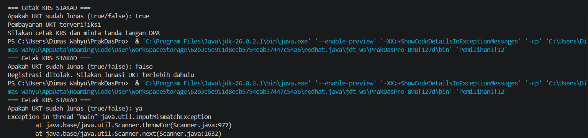

#### 2.1.3 Jawaban Pertanyaan / Pertanyaan Refleksi 
* **Pertanyaan 1:** Nilai apa yang harus dimasukkan agar kedua baris di dalam blok IF ikut tercetak? Jelaskan mengapa hanya nilai tersebut yang diterima!
    * **Jawab:** Nilai true, karena jika kondisi IF bernilai true maka akan mencetak perintah yang berada di dalam blok IF.
* **Pertanyaan 2:** Jalankan program, lalu masukkan false. Baris mana saja yang tercetak dan baris mana yang tidak? Jelaskan alur eksekusinya ketika kondisi IF bernilai false! 
    * **Jawab:** Hanya baris ke 7 dan ke 8 yang tercetak. Jika kondisi IF bernilai false, tidak akan mengeksekusi sesuatu.
* **Pertanyaan 3:** Jalankan program, lalu masukkan TRUE (huruf kapital) dan ya. Apa yang terjadi pada masing-masing input? Jika program berhenti dengan error, jelaskan penyebabnya! 
    * **Jawab:** Apabila input "TRUE" program akan tetap berjalan, tetapi jika input "ya" program akan error karena boolean hanya menerima true/false.
* **Pertanyaan 4:** Sistem perlu memberikan informasi apabila pengguna memasukkan nilai false, maka terdapat keluaran “Registrasi ditolak. Silakan lunasi UKT terlebih dahulu”. Modifikasi program tersebut dengan menambahkan struktur ELSE, , lalu tunjukkan hasil run untuk input true dan false! 
    * **Jawab:** 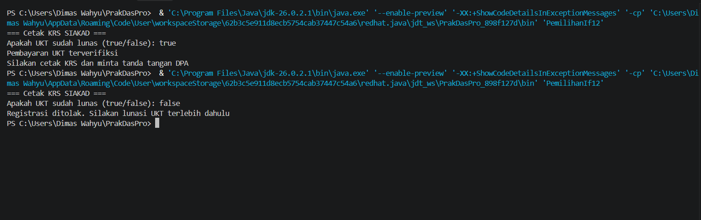

---

### 2.2 Percobaan 2: SWITCH-CASE untuk Mencetak KRS

Pada awal setiap semester, mahasiswa wajib mencetak KRS untuk ditanda tangani oleh Dosen Pembina Akademik. Sistem SIAKAD akan memeriksa semester mahasiswa saat ini, kemudian menampilkan KRS semester tersebut untuk dicetak. Berdasarkan kasus tersebut, program Java dibuat dengan penerapan SWITCH-CASE.

#### 2.2.1 Kode Program Java
```java
import java.util.Scanner;

public class PemilihanSwitch12 {
    public static void main(String[] args) {
        Scanner sc = new Scanner(System.in);

        System.out.println("=== Cetak KRS SIAKAD ===");
        System.out.print("Masukkan semester saat ini: ");
        int semester = sc.nextInt();

        switch (semester) {
            case 1:
                System.out.println("KRS emester 1 ditampilkan");
                break;
            case 2:
                System.out.println("KRS Semester 2 ditapilkan");
                break;
            case 3:
                System.out.println("KRS Semester 3 ditapilkan");
                break;
            case 4:
                System.out.println("KRS Semester 4 ditapilkan");
                break;
            case 5:
                System.out.println("KRS Semester 5 ditapilkan");
                break;
            case 6:
                System.out.println("KRS Semester 6 ditapilkan");
                break;
            case 7:
                System.out.println("KRS Semester 7 ditapilkan");
                break;
            case 8:
                System.out.println("KRS Semester 8 ditapilkan");
                break;
            default:
                System.out.println("Semester tidak valid");
        }
        sc.close();
    }
}
```

#### 2.2.2 Hasil Running / Screenshot Output
Berikut adalah contoh tampilan *output* setelah program dijalankan: 

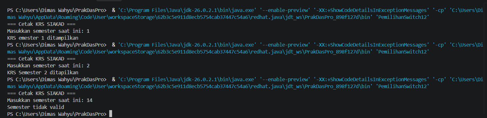

#### 2.2.3 Jawaban Pertanyaan / Pertanyaan Refleksi
* **Pertanyaan 1:** Hapus perintah break; pada case 5, lalu compile dan jalankan kembali program dengan masukan 5. Tuliskan keluaran yang muncul, lalu jelaskan apa fungsi break pada struktur SWITCH-CASE berdasarkan hasil percobaan Anda! Kembalikan kode seperti semula setelah selesai.
    * **Jawab:** Break digunakan untuk menghentikan program case 5 supaya tidak lanjut ke case 6 apabila memasukkan angka 5.
* **Pertanyaan 2:** Jalankan program dengan masukan 10, lalu dengan masukan 0. Apa keluaran yang muncul pada kedua percobaan tersebut? Berdasarkan hasil itu, jelaskan peran default dan apa yang akan terjadi pada program jika bagian default dihapus! 
    * **Jawab:** Dengan memasukkan angka 10 dan 0 akan menghasilkan output “Semester tidak valid” karena fungsi default untuk menjalankan angka yang tidak ada pada pilihan case. Jika default dihapus, maka ketika memasukkan angka yang tidak ada di pilihan case, program akan berhenti.
* **Pertanyaan 3:** Ganti tipe data variabel semester menjadi double, lalu compile programnya. Apakah program berhasil dicompile? Tuliskan pesan error yang muncul dan jelaskan penyebabnya. Sebutkan tipe data apa saja yang boleh digunakan sebagai ekspresi pada switch!
    * **Jawab:** Program akan menjadi error karena SWITCH-CASE tidak mendukung tipe data double. Tipe data yang boleh digunakan pada switch yaitu byte, short, char, int, String.
* **Pertanyaan 4:** Buat file baru dengan nama PemilihanIfElseNoPresensi.java. Ubah program cetak KRS yang menggunakan SWITCH-CASE tersebut ke dalam bentuk IF - ELSE IF - ELSE, dengan ketentuan keluaran program harus sama persis dengan versi SWITCH-CASE, termasuk untuk masukan yang tidak valid. Menurut Anda mana yang lebih mudah dibaca untuk kasus ini, dan mengapa?
    * **Jawab:** Lebih jelas untuk bilangan diskrit, tampilan rapih dan mudah dibaca, dan lebih ringkas.
    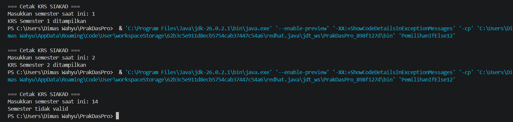

---

## 3: TUGAS MANDIRI

Berikut adalah daftar tugas yang dikerjakan pada Jobsheet ini:

- [x] **Tugas 1:** Mengubah struktur `IF-ELSE` menjadi `Ternary Operator`.
- [x] **Tugas 2:** Membuat program berdasarkan *Flowchart* penentuan SKS. 
- [x] **Tugas 3:** Mengimplementasikan studi kasus parkir & antrean.

### 3.1 Tugas 1

#### 3.1.1 Kode Program Java
```java
import java.util.Scanner;

public class Tugas1Pemilihan12 {
    public static void main(String[] args) {
        Scanner sc = new Scanner(System.in);

        String pesan;
        System.out.println("=== Cetak KRS SIAKAD ===");
        System.out.print("Apakah UKT sudah lunas (true/false): ");
        boolean uktLunas = sc.nextBoolean();

        pesan = (uktLunas) ? "Pembayaran UKT terverifiksi" : "Silakan cetak KRS dan minta tanda tangan DPA";
        System.out.println(pesan);
        sc.close();
    }
}
```

#### 3.1.2 Hasil Running / Screenshot Output
Berikut adalah contoh tampilan *output* setelah program dijalankan: 
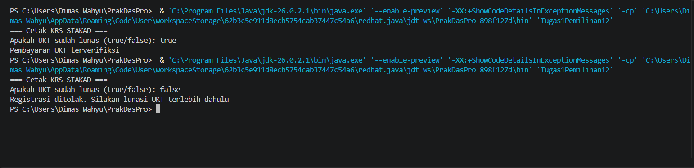

### 3.2 Tugas 2

#### 3.2.1 Kode Program Java
```java
import java.util.Scanner;

public class Tugas2PemilihanIf12 {
    public static void main(String[] args) {
        Scanner sc = new Scanner(System.in);

        int jumlahSkS;
        
        System.out.print("Masukkan jumlah SKS: ");
        jumlahSkS = sc.nextInt();

        if (jumlahSkS > 24) {
            System.out.println("Melebihi batas");
        } else {
            System.out.println("KRS valid");
        }
        sc.close();
    }   
}
```

#### 3.2.2 Hasil Running / Screenshot Output
Berikut adalah contoh tampilan *output* setelah program dijalankan: 
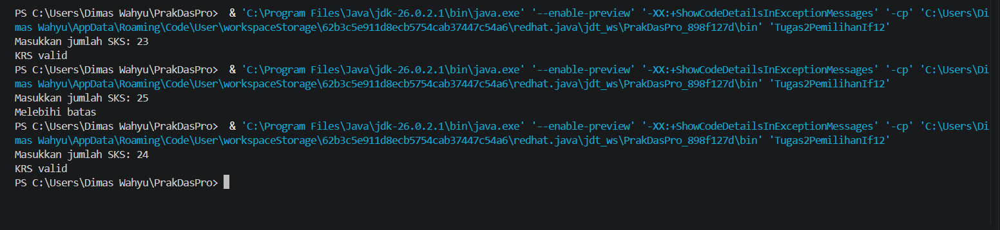

### 3.3 Tugas 3

#### 3.3.1 Soal 1
##### 3.3.1.1 Kode Program Java
```java
import java.util.Scanner;

public class TugasParkir12 {
    public static void main(String[] args) {
        Scanner sc = new Scanner(System.in);

        System.out.println("\n=== Tarif Parkir ===");
        System.out.print("Masukkan lama parkir: ");
        int lamaParkir = sc.nextInt();

        if (lamaParkir <= 2) {
            System.out.println("Tarif Rp. 2000");
        } else {
            int tarif = (lamaParkir - 2) * 1000 + 2000;
            System.out.println("Tarif Rp. " + tarif);
        }
        sc.close();
    }
}
```

##### 3.3.1.2 Hasil Running / Screenshot Output
Berikut adalah contoh tampilan *output* setelah program dijalankan: 
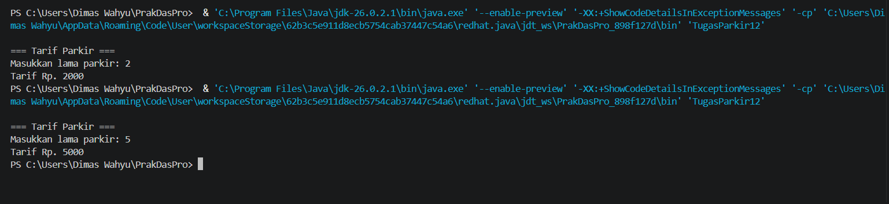

#### 3.3.2 Soal 2
##### 3.3.2.1 Kode Program Java
```java
import java.util.Scanner;

public class TugasAntrean12 {
    public static void main(String[] args) {
        Scanner sc = new Scanner(System.in);

        System.out.println("\n=== Akademik Kampus ===");
        System.out.println("1. Legalisir Ijazah");
        System.out.println("2. Surat Keterangan Aktif Kuliah");
        System.out.println("3. Pembayaran UKT");
        System.out.println("4. Pengajuan Cuti Akademik");
        System.out.print("Masukkan kode layanan: ");
        int kode = sc.nextInt();

        System.out.println();
        switch (kode) {
            case 1:
                System.out.println("Legalisir Ijazah: Loket A");
                break;
            case 2: 
                System.out.println("Surat Keterangan Aktif Kuliah: Loket B");
                break;
            case 3:
                System.out.println("Pembayaran UKT: Loket C");
                break;
            case 4: 
                System.out.println("Pengajuan Cuti Akademik: Loket D");
                break;
            default:
                System.out.println("Layanan tidak tersedia");
                break;
        }
        System.out.println();
        sc.close();
    }
}
```

##### 3.3.2.2 Hasil Running / Screenshot Output
Berikut adalah contoh tampilan *output* setelah program dijalankan: 
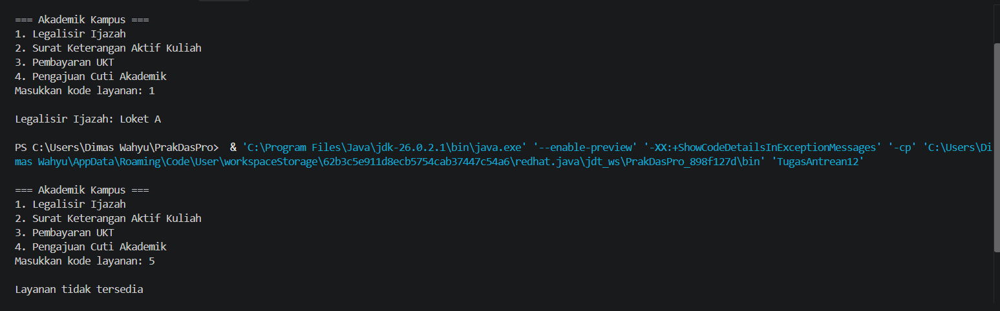

### 3.4 Tugas 4

#### 3.4.1 Kode Program Java
```java
import java.util.Scanner;

public class NusantaraPay12 {
    public static void main(String[] args) {
        Scanner sc = new Scanner(System.in);

        String status;
        int limit = 10000;

        System.out.println("\n=== Nusantara Pay: Sistem Keamanan Transaksi ===");
        System.out.print("\nStatus Akun (Normal/Suspicius/Black-listed): ");
        String statusAkun = sc.nextLine();
        System.out.print("Masukkan nominal transaksi: ");
        double nominal = sc.nextDouble();
        System.out.print("Masukkan sisa saldo: ");
        double sisaSaldo = sc.nextDouble();
        System.out.print("Apakah transaksi di luar negeri? (True/False): ");
        boolean isBedaNegara = sc.nextBoolean();
        System.out.print("Masukkan jam transaksi: ");
        double jam = sc.nextDouble();

        if (statusAkun.equalsIgnoreCase("BLACK-LISTED")) {
            status = "REJECTED_BLACKLIST";
        } else if (nominal > sisaSaldo) {
            status = "REJECTED_SALDO";
        } else if (nominal > limit) {
            status = "REJECTED_LIMIT";
        } else if (isBedaNegara == true && nominal > 2000) {
            status = "FLAGGED_FRAUD";
        } else if (jam >= 0 && jam <= 4 && nominal > 1000) {
            status = "REQUIRED_OTP_NIGHT";
        } else if (statusAkun.equalsIgnoreCase("SUSPICIOUS") && nominal > 500) {
            status = "REQUIRE_OTP_SUSPICIOUS";
        } else {
            status = "APPROVED";
        }
        System.out.print("\nStatus Akun: " + status);
        System.out.println();
        sc.close();
    } 
}
```

#### 3.4.2 Hasil Running / Screenshot Output
Berikut adalah contoh tampilan *output* setelah program dijalankan:
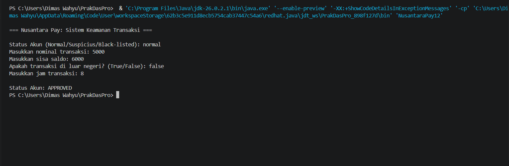 

### 3.5 Tugas 5

#### 3.5.1 Kode Program Java
```java
import java.util.Scanner;

public class RSHarapanKita12 {
    public static void main(String[] args) {
        Scanner sc = new Scanner(System.in);

        String status;

        System.out.println("\n=== UGD RS Harapan Kita: Alokasi Ruang Darurat ===");
        System.out.print("Masukkan SpO2 (%): ");
        double spo2 = sc.nextDouble();
        System.out.print("Masukkan Sisa Bed ICU: ");
        int sisaBedICU = sc.nextInt();
        System.out.print("Masukkan tekanan darah sistolik: ");
        int tekananDarah = sc.nextInt();
        System.out.print("Apakah kondisi pasien tidak sadar? (true/false): ");
        boolean pasien = sc.nextBoolean();
        System.out.print("Masukkan suhu: ");
        int suhu = sc.nextInt();
        System.out.print("Apakah memiliki koromoid? (true/false): ");
        boolean koromoid = sc.nextBoolean();
        System.out.print("Masukkan usia pasien: ");
        int usia = sc.nextInt();
        System.out.print("Masukkan laju napas per menit: ");
        int napas = sc.nextInt();

        if (spo2 < 85) {
            if (sisaBedICU > 0) {
                status = "ICU";
            } else {
                status = "UGD_VENTILATOR_MOBIL";      
            }
        } else if ((spo2 >= 85 && spo2 <= 89) || (tekananDarah < 90 || tekananDarah> 180) || (pasien == true )) {
            status = "RESUSITASI_UGD";
        } else if ((spo2 >= 90 && spo2 <= 94 || suhu > 39) && koromoid == true && usia >= 65) {
            status = "HCU_ISOLASI";
        } else if (spo2 >= 90 && spo2 <= 94 || napas > 24) {
            status = "RAWAT_INAP_UMUM";
        } else {
            status = "RAWAT_JALAN";
        }
        System.out.println("\n=== Status Pasien: " + status + " ===");
        sc.close();
    }
}
```
#### 3.5.2 Hasil Running / Screenshot Output
Berikut adalah contoh tampilan *output* setelah program dijalankan: 
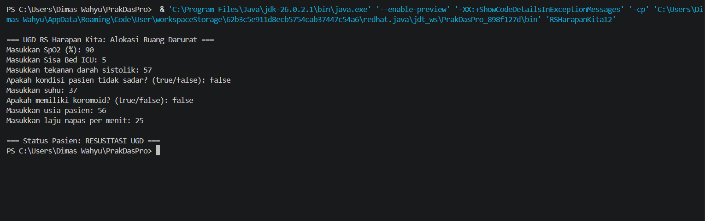

### 3.6 Tugas 6
#### 3.6.1 Kode Program Java
```java
import java.util.Scanner;

public class KonsultanPajak12 {
    public static void main(String[] args) {
    Scanner sc = new Scanner(System.in);
    
    int nilai;
    double pajak;

    System.out.println("\n=== Konsultan Pajak: Kalkulator PPh 21 Progresif ===");
    System.out.print("Masukkan nilai PKP: ");
    nilai = sc.nextInt();
    
    if (nilai <= 0) {
        pajak = 0;
    } else if (nilai <= 60000000) {
        pajak = 0.05 * nilai;
    } else if (nilai <= 250000000)  {
        pajak = ((0.05 * 60000000) + (0.15 * (nilai - 60000000)));
    } else if (nilai <= 500000000) {
        pajak = ((0.05 * 60000000) + (0.15 * 190000000) + (0.25 * (nilai - 250000000)));
    } else {
        pajak = ((0.05 * 60000000) + (0.15 * 190000000) + (0.25 * 250000000) + (0.30 * (nilai - 500000000)));
    }
    System.out.println("\n=== Hasil ===");
    System.out.println("PKP\t: Rp " + nilai);
    System.out.println("Pajak\t: Rp " + pajak);
    sc.close();
    }
}
```

#### 3.6.2 Hasil Running / Screenshot Output
Berikut adalah contoh tampilan *output* setelah program dijalankan: 
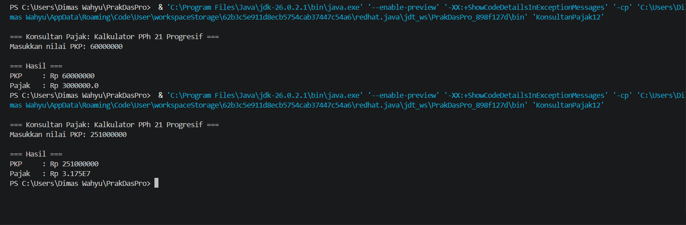

---

## 4: KESIMPULAN
* ```IF``` digunakan jika memiliki satu kondisi.
* ```IF ELSE``` digunakan jika memiliki dua kondisi.
* ```IF ELSE-IF ELSE``` digunakan jika memiliki lebih dari satu kondisi. 
* ```SWITCH CASE``` digunakan untuk memilih berdasarkan beberapa nilai yang tersedia.