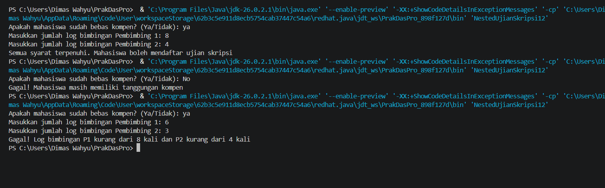
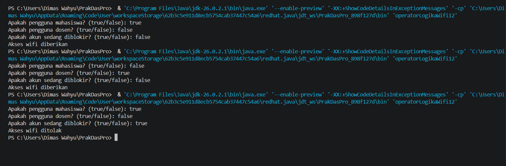
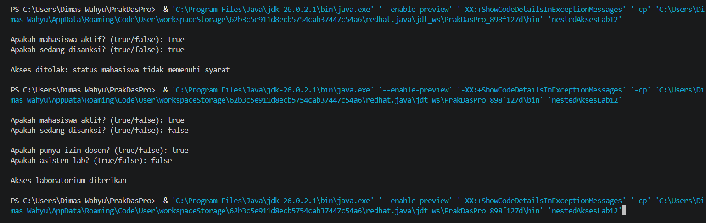
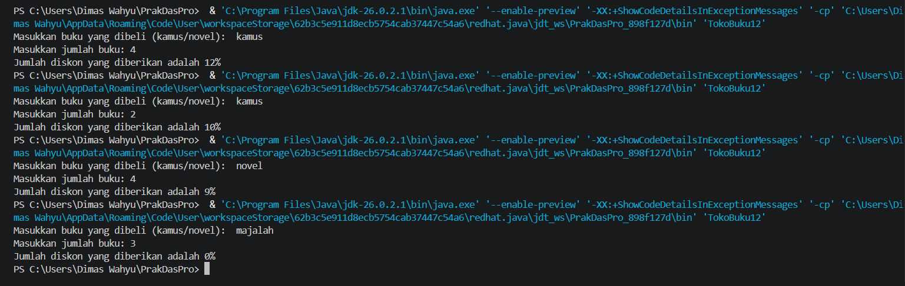
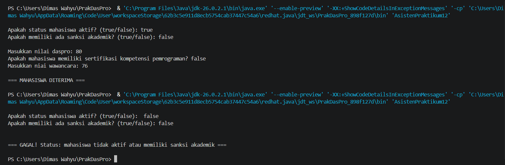

# JOBSHEET 5 - PEMILIHAN 2

**Identitas Mahasiswa:**
* **Nama:** Dimas Wahyu Ramadhani
* **NIM:** 264107020104
* **Kelas / No. Presensi:** 1D / 12

___

## 1. TUJUAN PRAKTIKUM

Berikut adalah tujuan pelaksanaan praktikum pada bab ini:

1. Mahasiswa mampu menyelesaikan permasalahan/studi kasus menggunakan sintaks pemilihan bersarang.
2. Mahasiswa mampu menerapkan sintaks pemilihan bersarang ke dalam program Java.
3. Mahasiswa mampu menerapkan operator logika &&, ||, dan ! pada struktur pemilihan.

---

## 2: HASIL PERCOBAAN & ANALISIS

### 2.1 Percobaan 1: Penerapan IF dan IF-ELSE untuk Mencetak KRS

Seorang mahasiswa akan mendaftar ujian skripsi. Sistem SIMTA akan memeriksa syarat administrasi terlebih dahulu, yaitu mahasiswa harus bebas kompen. Jika syarat ini terpenuhi, sistem kemudian memeriksa catatan log bimbingan. Untuk bisa mendaftar ujian, mahasiswa harus memiliki minimal 8 kali bimbingan dengan pembimbing 1 dan minimal 4 kali bimbingan dengan pembimbing 2. Jika semua syarat terpenuhi, mahasiswa dapat melanjutkan ke proses pendaftaran ujian skripsi. Jika tidak, sistem akan menampilkan alasan kegagalan.

#### 2.1.1 Kode Program Java
```java
import java.util.Scanner;

public class NestedUjianSkripsi12 {
    public static void main(String[] args) {
        Scanner sc = new Scanner(System.in);

        String pesan;
        System.out.print("Apakah mahasiswa sudah bebas kompen? (Ya/Tidak): ");
        String bebasKompen = sc.nextLine().trim();

        if (bebasKompen.equalsIgnoreCase("ya")) {
            System.out.print("Masukkan jumlah log bimbingan Pembimbing 1: ");
            int bimbingan1 = sc.nextInt();
            System.out.print("Masukkan jumlah log bimbingan Pembimbing 2: ");
            int bimbingan2 = sc.nextInt();
            if (bimbingan1 >= 8 && bimbingan2 >= 4) {
                pesan = "Semua syarat terpenuhi. Mahasiswa boleh mendaftar ujian skripsi";
            } else if (bimbingan1 < 8 && bimbingan2 < 4) {
                pesan = "Gagal! Log bimbingan P1 kurang dari 8 kali dan P2 kurang dari 4 kali";
            } else if (bimbingan1 < 8) {
                pesan = "Gagal! Log bimbingan P1 belum mencapai 8 kali";
            } else {
                pesan = "Gagal! Log bimbingan P2 belum mencapai 4 kali";
            }
        } else {
            pesan = "Gagal! Mahasiswa masih memiliki tanggungan kompen";
        }
        System.out.println(pesan);
        sc.close();
    }
}
```

#### 2.1.2 Hasil Running / Screenshot Output
Berikut adalah contoh tampilan *output* setelah program dijalankan:
 

#### 2.1.3 Jawaban Pertanyaan / Pertanyaan Refleksi
* **Pertanyaan 1:** Apa yang terjadi jika mahasiswa menjawab "No" pada pertanyaan bebas kompen? Mengapa demikian?
    * **Jawab:** Program akan mengeksekusi blok ELSE dan akan menampilkan pesan "Gagal! Mahasiswa masih memiliki tanggungan kompen"
* **Pertanyaan 2:** Jelaskan maksud dari potongan kode berikut!
    ```java
    if (bimbingan1 >= && bimbingan2 >= 4) {}
    ```   
    * **Jawab:** Mahasiswa dapat mendaftar ujian skripsi jika bimbingan ke pembimbing 1 lebih dari sama dengan 8 dan bimbingan ke pembimbing 2 lebih dari sama dengan 4.
* **Pertanyaan 3:** Bagaimana alur pemeriksaan syarat mahasiswa dari awal sampai akhir? Jelaskan secara runtut untuk semua kondisi!
    * **Jawab:** 3. Pertama, cek kondisi apakah mahasiswa bebas kompen atau tidak. Selanjutnya, jika kondisi TRUE maka akan lanjut untuk menginput banyak bimbingan kepada pembimbing1 dan pembimbing2 sedangkan jika kondisi FALSE maka mahasiswa masih memiliki tanggungan kompen. Jika banyak bimbingan kepada pembimbing 1 lebih dari sama dengan 8 dan kepada pembimbing 2 lebih dari sama dengan 4, maka mahasiswa boleh mendaftar ujian skripsi. Jika banyak bimbingan kepada pembimbing 1 kurang dari 8 dan kepada pembimbing 2 kurang dari 4, maka mahasiswa tidak dapat mendaftar ujian skripsi. Jika banyak bimbingan kepada pembimbing 1 kurang dari 8, maka mahasiswa tidak dapat mendaftar ujian skripsi. Jika banyak bimbingan kepada pembimbing 2 kurang dari 4, maka mahasiswa tidak dapat mendaftar ujian skripsi.

### 2.2 Percobaan 2: Operator Logika untuk Menentukan Akses Wifi Kampus

Sistem WiFi kampus hanya dapat digunakan oleh mahasiswa atau dosen yang akunnya tidak diblokir. Program menerima informasi apakah pengguna merupakan mahasiswa, dosen, dan apakah akun pengguna sedang diblokir. Akses diberikan apabila pengguna merupakan mahasiswa atau dosen, dan akun pengguna tidak diblokir. Percobaan ini digunakan untuk mempraktikkan operator logika && (AND), || (OR), dan ! (NOT). 

##### 2.2.1 Kode Program Java

```java
import java.util.Scanner;

public class operatorLogikaWifi12 {
    public static void main(String[] args) {
        Scanner sc = new Scanner(System.in);

        boolean mahasiswa, dosen, akunDiblokir;

        System.out.print("Apakah pengguna mahasiswa? (true/false): ");
        mahasiswa = sc.nextBoolean();
        System.out.print("Apakah pengguna dosen? (true/false): ");
        dosen = sc.nextBoolean();
        System.out.print("Apakah akun sedang diblokir? (true/false): ");
        akunDiblokir = sc.nextBoolean();

        if ((mahasiswa || dosen) && !akunDiblokir) {
            System.out.println("Akses wifi diberikan");
        } else {
            System.out.println("Akses wifi ditolak");
        }
        sc.close(); 
    }
}
```

#### 2.2.2 Hasil Running / Screenshot Output
Berikut adalah contoh tampilan *output* setelah program dijalankan:


#### 2.2.3 Jawaban Pertanyaan / Pertanyaan Refleksi

1.  Jelaskan fungsi operator ||, &&, dan ! pada kondisi program tersebut. 
    * **Jawab:** 
        - || menghasilkan TRUE jika salah satu kondisi TRUE
        - && menghasilkan TRUE jika kedua kondisi TRUE
        - ! menegasikan kondisi.
2. Mengapa pengguna dosen tetap dapat memperoleh akses ketika nilai mahasiswa = false? 
    * **Jawab:** Karena pada kondisi IF menggunakan operator || sehingga salah  satu syarat terpenuhi maka akan menghasilkan TRUE.
3. Ubah operator || menjadi &&. Jalankan kembali program menggunakan data uji 1 dan 2. Apa yang terjadi dan mengapa? 
    * **Jawab:** 
        - Uji 1 (mahasiswa = true, dosen = false) menghasilkan FALSE.
        - Uji 2 (mahasiswa = false, dosen = true) menghasilkan FALSE.
4. Pada ekspresi mahasiswa || dosen, kapan kondisi dosen tidak perlu dievaluasi? Jelaskan berdasarkan short-circuit evaluation. 
    * **Jawab:** Jika kondisi mahasiswa TRUE maka menghasilkan TRUE. Karena OR sudah cukup dengan satu kondisi true.
5. Pada ekspresi (mahasiswa || dosen) && !akunDiblokir, kapan kondisi !akunDiblokir tidak perlu dievaluasi? Jelaskan.
    * **Jawab:** Jika kondisi (mahasiswa || dosen) bernilai FALSE. Karena AND akan langsung FALSE jika salah satu FALSE.

### 2.3 Percobaan 3: Nested IF dan Operator Logika untuk Menentukan Akses Laboratorium

Mahasiswa dapat menggunakan laboratorium di luar jadwal kuliah apabila statusnya aktif dan tidak sedang mendapatkan sanksi. Jika syarat tersebut terpenuhi, sistem melakukan pemeriksaan kedua. Akses laboratorium diberikan apabila mahasiswa memiliki izin dosen atau merupakan asisten laboratorium. Kasus ini menggabungkan pemilihan bersarang dengan operator logika. 

#### 2.3.1 Kode Pemrograman Java

```java
import java.util.Scanner;

public class nestedAksesLab12 {
    public static void main(String[] args) {
        Scanner sc = new Scanner(System.in);

        boolean mahasiswaAktif, sedangDisanksi, punyaIzinDosen,
        asistenLab;

        System.out.print("\nApakah mahasiswa aktif? (true/false): ");
        mahasiswaAktif = sc.nextBoolean();
        System.out.print("Apakah sedang disanksi? (true/false): ");
        sedangDisanksi = sc.nextBoolean();
        
        if (mahasiswaAktif && !sedangDisanksi) {
            System.out.print("\nApakah punya izin dosen? (true/false): ");
            punyaIzinDosen = sc.nextBoolean();
            System.out.print("Apakah asisten lab? (true/false): ");
            asistenLab = sc.nextBoolean();
            if (punyaIzinDosen || asistenLab) {
                System.out.println("\nAkses laboratorium diberikan\n");
            } else {
                System.out.println("\nAkses ditolak: membutuhkan izin dosen atau status asisten lab\n");;
            }
        } else {
            System.out.println("\nAkses ditolak: status mahasiswa tidak memenuhi syarat\n");;
        }
        sc.close();
    }
}
```

#### 2.3.2 Hasil Running / Screenshot Output
Berikut adalah contoh tampilan *output* setelah program dijalankan:


#### 2.3.3 Jawaban Pertanyaan / Pertanyaan Refleksi

1. Mengapa pemeriksaan punyaIzinDosen || asistenLab ditempatkan di dalam IF pertama? 
    * **Jawab:** 
2. Jelaskan fungsi operator &&, ||, dan ! pada program tersebut.
    * **Jawab:**
        - && menghasilkan TRUE jika kedua kondisi TRUE
        - || menghasilkan TRUE jika salah satu kondisi TRUE
        - ! menegasikan kondisi.
3. Apakah syarat akses dapat ditulis menjadi satu kondisi: mahasiswaAktif && !sedangDisanksi && (punyaIzinDosen || asistenLab)? Jelaskan apakah keputusan akses akhirnya sama. 
    * **Jawab:** Hasilnya akan tetap sama (akses diberikan/ditolak). Tapi dengan Nested IF, sistem bisa memberi alasan penolakan lebih spesifik (misalnya gagal karena disanksi, atau gagal karena tidak punya izin).
4. Apa keuntungan menggunakan Nested IF pada kasus ini dibandingkan hanya satu IF jika sistem perlu menampilkan alasan penolakan yang berbeda? 
    * **Jawab:** Alurnya lebih jelas dan bisa menampilkan alasan penolakan berbeda sesuai tahap.
5. Buat satu kombinasi masukan yang menyebabkan akses ditolak pada level pertama dan satu kombinasi yang menyebabkan akses ditolak pada level kedua.
    * **Jawab:** 
        - Level 1: mahasiswaAktif = false, sedangDisanksi = true punyaIzinDosen = true, asistenLab = true.
        - Level 2: mahasiswaAktif = true, sedangDisanksi = false, punyaIzinDosen = false, asistenLab = false.

## 3: TUGAS MANDIRI

Berikut adalah daftar tugas yang dikerjakan pada Jobsheet ini:

- [x] **Tugas 1:** Membuat program menggunakan Nested IF.
- [x] **Tugas 2:** Membuat program menggunakan Nested IF.

### 3.1 Tugas 1
#### 3.1.1 Kode Program Java
```java

```

#### 3.1.2 Hasil Running / Screenshot Output
Berikut adalah contoh tampilan *output* setelah program dijalankan:


### 3.2 Tugas 2
#### 3.2.1 Kode Program Java
```java

```

#### 3.2.2  Hasil Running / Screenshot Output
Berikut adalah contoh tampilan *output* setelah program dijalankan:
